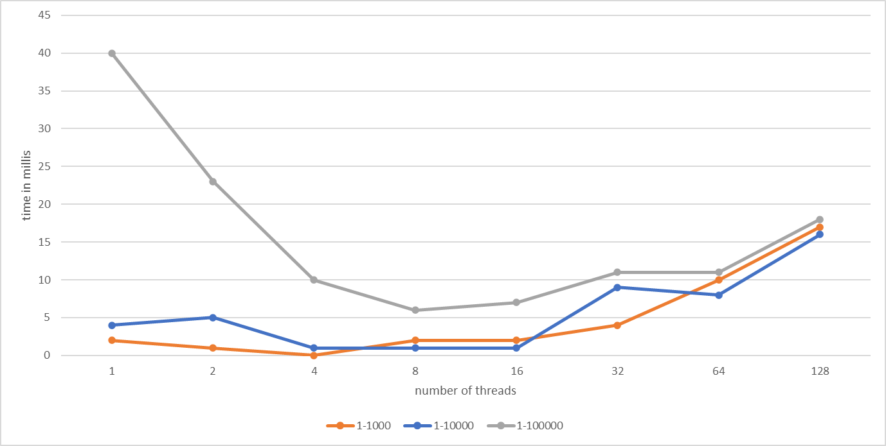

تم استخدام حاسب Dell يحوي معالج Intel Core i7 8th gen وذاكرة 8GB Ram 

في هذه المخططات البيانية يتوضح تأثير زيادة عدد النياسب على الأداء حيث انه بالنسبة لكل مجال يوجد نقطة تشبع بالنسبة لعدد النياسب لافائدة من زيادة عدد النياسب بعدها بل أن زيادة عدد النياسب بعد هذه النقطة سيؤدي إلى بطئ في زيادة التنفيذ

يؤثر حجم المجال على الأداء حيث انه عندما يكون حجم المجال صغيرا لافائدة من استخدام النياسب المتعددة بينما يوجد حجم مثالي للمجال 
بنية المعالج اذا كان يحتوي على عدة نوى تؤثر ايجابا اي تسرع عمل البرنامج الذي يعتمد على النياسب المتعددة ضمن الشروط السابقة حيث انه يتم تنفيذ اكثر من نسيب بشكل متزامن مما يؤدي إلى أيجاد الأعداد الأولية بشكل اسرع 

